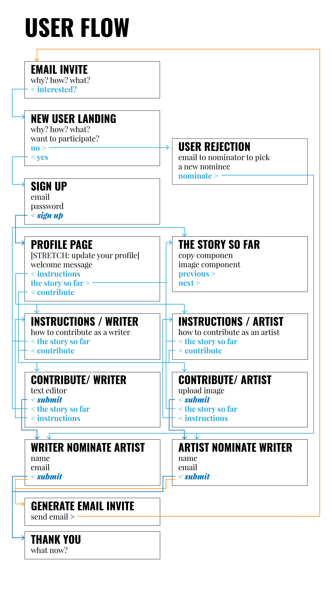
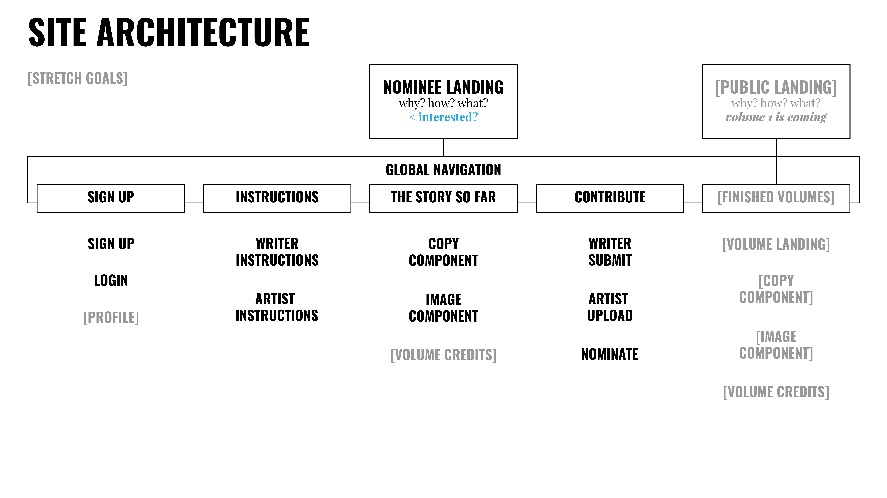
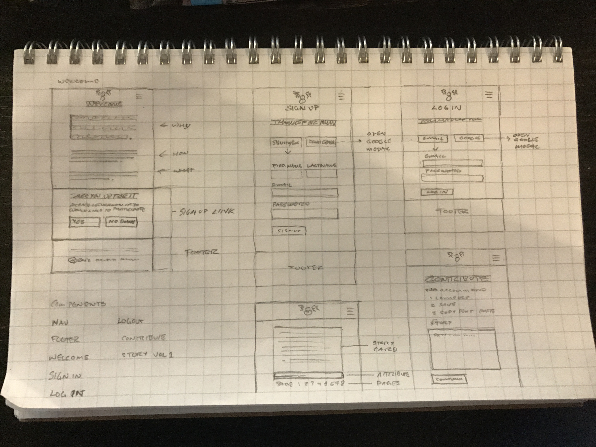

# }}8{{
# INSPIRATION ONLY
# THE HIGH ORDER OF THE OCTOMOOSE

## why does this need to exist?
inspiration only by the high order of the octomoose allows creatives to collaborate on creating original stories, with each participant able to influnce the direction the story takes next. 

## how does it work?
participants are nominated by their peers to participate. participants will alternate from writer to artist. each participant is responsible for the next step in the story. once a participant has their contribution saved, they nominate the next participant.

## what is it?
inspiration only is a full stack app to fascilitate collabortation between writers and artists on generating original stories.

## deployed on firebase
https://inspiration-only.firebaseapp.com

## user stories
[trello](https://trello.com/b/6iWEWmYp/project-4-octomoose)

## technologies
* angular
* typescript
* material design for bootstrap - angular
* sass
* firebase
* google cloud
* email integration(???)

## user flows

## site architecture

## wireframes

## look and feel
}}8{{

google fonts:
* <link href="https://fonts.googleapis.com/css?family=Oswald:300,700|Playfair+Display:400,900,900i" rel="stylesheet">
* font-family: 'Playfair Display', serif;
** font-weight: 400, 900
** font-style: italic (900 only)
* font-family: 'Oswald', sans-serif;
** font-weight: 300, 700

## links
* https://angular.io/
* https://www.typescriptlang.org/
* http://mdbootstrap.com/angular/
* http://sass-lang.com/
* https://firebase.google.com/
